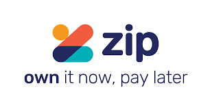

# *Case Study: Zip, Helping Australians simplify how people pay everywhere and save every day by offering fast, fair and seamless solutions online and in-store.*
**Background** 

Zip is a FinTech company provide payment service platform in Australia, NZ, US UK and South Africa. The key service of Zip is a Buy-Now-Pay-Later (BNPL) payment solution and swift short & long term loans for individuals and small businesses (SMBs) using fintech technologies such as data science, cloud infrastructure, big data, machine learning and API through brick and mortal via retailers, web services and mobile apps. 

Zip was founded in SYD in 2013 by two entrepreneurs Larry Diamond and Peter Gray seeing the credit card market breaks and not able to offer flexible products or track millennials they have thought to provide a digital alternative that was on the side of customer bringing interest free terms to improve the financial service. Their aim is to build an ecosystem where everyone can freely experience new generation payment services by creating a better relationship with customers and retailers and act as a conduit that is bringing those two parties together.

The fintech company was listed on ASX in Sep 2015 and has been exponentially growing ever since. In 2020 FY they generated strong growth revenue up 91% YoY to 161M, customer increased 61% YoY to 2.1M and transaction volume of 2.1B 91% YoY increase. In terms of Global expansion, like Afterpay ($24.8B market cap), Klarna ($31B), Affirm($13.92B) and Sezzle ($0.76B), Zip ($3.91B) sees a big opportunity in the UK US retail market. Zip is well positioned with $403m acquisition of Quadpay in the US and has raised more than $60m to expand into US $5 trillion retail market. The Acquisition of Part Pay in 2019 accelerated their market entry in NZ, UK and South Africa. These acquisitions and expansions are helping Zip to be well positioned and quickly scale up its business model globally.
 
**Technology towards digital payments and a rise of BNPL service**

Global digital payments industry has seen many innovations over the past decade. The development of advanced technologies not only encouraged entrepreneurs to enter into fintech businesses with minimum costs but also allowed them access to vast amount of data efficiently and have a chance to compete with larger companies with existing infrastructure. Cloud computing and infrastructure allowed them to operate with minimum upfront and overhead costs such as server maintenance. Big data significantly allowed companies to process data more efficiently and drive more timely data-driven analysis. Many fintech firms deploy Machine learning to readily analyse and research consumer spending patterns and preferences to improve customer experience on their platform. Machine learning is also used for differentiating and grouping customers into different classes and enable users to learn from customer spending patterns and behaviour dynamics. API or SDK for both online and In-store documentation allowed many SMBs to utilize and exchange information on their software environment quickly at very low cost. These technologies built a new paradigm shift for SMBs to enter into the market with new ideas and new business opportunities. The trend of digital payments is invested heavily even today. The total transaction value of digital payments grew from US$4.1 trillion in 2019 to US$5.2 trillion in 2020 and by 2025 it is set to reach US$10.5 trillion value. (The fintech times 2020)

BNPL service was first introduced by Afterpay in 2015 and has caught the eye of many investors. This business model has rapidly grown, and many companies have joined the market due to relatively easy to copy model yet allow seamless payment system for retailers and consumers. 

BNPL creates winwin for both consumers and retailers through integrated payment platform. It enables consumers to receive product and services upfront, ability to pay off balance over time and free to use the service. For retailers, drives increase in sales due, receive full amount of sale upfront less merchant fee which means they do not take on the customer default risk. 

**Comparison of Zip and competitors of BNPL services and its metrics**

 Afterpay gives customers the option to buy goods or services immediately and then pay for them in four equal instalments due every two weeks. The retailer pays a fee to Afterpay so there is no upfront cost to customers. There is a late fee which vary depends on the volume of purchase $10 < $40, 25% of the purchase price for $40-$272 and $68 for any purchases >$272 plus $7 after 7 days. (Afterpay HP)

Klarna offers product called “Pay in 4” which let consumers to pay into four equal instalments to be paid every two weeks with the first payment due at checkout. Late fee of up to $7 is charged after two tries. Another product is called “Pay in 30” where customer can pay nothing upfront and settle within 30 days. “Pay Now” is like making immediate purchase with debit card however customers can enjoy the benefits of using their App such as price-drop and exclusive offers. (Klarna HP)

Zip offers more flexible payment solutions such as Zip pay which gives greater used for regular shopping under $1000 with minimum repay of $40 dollars per month to be made anytime whereas Zip money is for a larger payment option online, in-store and BPAY.  Virtual card introduced through their App can be used online anywhere where master card is accepted and can be added to google pay and apple pay to use install payment. Zip charges customers $6 dollars flat charge for any outstanding balance over one month and late fee of $5 if repay customers fail to pay $40 per month. For Zip money, interest may be charged depends on the product that customers purchase. Establishment fee is free for Zip pay however establishment fee max $100 is charged for Zip money at the time of application. (Zip HP)
	
BNPL companies measure their performance based on the indicator such as market transaction value, number of active customers and active merchants. At the end of 2020, Afterpay leading the BNPL market transaction value of $8.3 billions, active users of 3.4 million and 53,600 active merchants. Whereas ZIP 2.6 billion transaction value, 2.5 million active users and 30,100 active merchants. By online payments method, BNPL is still very low share compared to other means of payment such as BPAY/bank transfer and debit, credit payments. In 2019 less than 2 per cents of total online payments were made through BNPL. (Bloomberg 2020) This means that BNPL service is still weighs a small portion of online payment services in Australia and there is so much more potential to grow for many start-ups.

**Key Strength**

While receivable turnover is slower than most of the competitors of BNPL, 30 days for Afterpay whereas an average of seven to eight months for Zip, Zip provides more flexible payment options to consumers. Unlike other BNPL where they put a fixed payment amount and schedule, Zip service allows customers to reschedule payment according to their needs and requirements.  Zip service Zippay possess strong advantage over other competitors it offers credit account features and allow to reach beyond discretionary retail and services. E.g. paying Bpay bills over Zippay. Zip also provides ZIP trade which is a B2B BNPL offering up to $3k for SMBS and ZIP trade+ an interest free (limited time only) account up to $150k. For SMBs commissions and transactions are cheaper than Afterpay. 30 cents per transaction for Afterpay against 15 cents for Zip. Commission range from 4 to 6 % for Afterpay whereas 2 – 4 % for Zippay. Marchant payment are faster for Zippay as it retailers can receive it everyday by 4pm whereas Afterpay takes up to 48 hrs after the transaction. (Straight-out-digital 2018)

Zip conduct identity check on every customers and monitor transactions using their own risk algorithms, leverage traditional and alternative credit data to optimize and enhance their credit decisions. Third-party credit checks are performed by Equifax or illion. This is largely a function of Zip’s classification as a provider of credit and therefore it is subject to strict protocols under its Australia Credit Licence and the National Consumer Credit Protection Act 2009 (NCCP). Cloud based loan engine is used to manage loan originations and billing accounts and customer statements. Credit decision of up to $2,000 is done by machine learning to reduce portfolio. (Visionaries + Innovation Series 2020) While there is no limitation on credit card spending, digital service can automatically place limit or tighten up approvals and respond to agile shift in the market and economic circumstances such as Covid. 

Zip invests on big data analytic and computer science to learn customer spending behaviour and its dynamics, data tracing records using machine learning. ZIP heavily utilizes the rich sources of big data to nailing credit performance, next best action, recommendation to engine personalization. One of the big reasons why Westpac invested in ZIP is how ZIP is underlining consumers and digest a large volume of information compare to all other piers on the consumer onboarding process. 

**Challenge of IT management**

With a diverse use of desktop, laptops, mobile devices Zip experienced some major IT issues in its network. Zip did not have mobile device management (MDM) software in place 
and only monitored via a manual SharePoint List by the level 1 support technicians on an ad-hoc basis. There was no procurement strategy in place and computers were purchased by a department other than IT. There were no provisional solutions such as Apple Business Manager (ABM) in place and vendor relationships were very limited. Furthermore, Zip relied on other companies to push software, policies and add patches to their machines. So central control to manage IT was absent. 

Jacob Turjman Business IT manager at Zip quickly realized the issue and raised opinion that more integrated management engine was required to be implemented for the IT system expansion. (Management Engine 2020) The implementation of ‘Desktop Central’ allowed ZIP a management solution to
patching, software deployment, IT asset, reporting and remote desktop sharing from a single point. Desktop Central is a browser-based interface which Automated patch management, mobile device management (add-on), usb device management, software enable to manage patching from a single point. i.e. install agent. With the integration of Desktop Central and Azure Active Directory Zip became able to have improved capabilities with MDM (Mobile Device Management) and have all-in-one management solutions to manage from a single dashboard. 

**Rising issue of Non-surcharging rule**

BNPL services have changed the consumer payments landscape through mobile tech and innovative businesses. While innovation and competition enhanced the efficiency of the payments system by providing services that meet end-user needs, they have also raised some issues for policymakers. Retailers who accept BNPL payments enjoy increase in sales and avoid risk of default from the end-users but in turn pay higher merchant fee compare to other electrical payment methods. Most BNPL firms also impose no-surcharge rule which prevents retailers to pass these costs to the customers who use and benefit from BNPL services. This no-surcharge rule has caught the interest of the stakeholders in the society and lead RBA and Payment System Board (PSB) to review the Retail Payments Regulation. 

PSB view that that it is still too early to point that costs arising from no-surcharge rules exceed the potential benefit in terms of innovation which BNPL businesses bring into Australia.  (RBA 2021) RBA cited a 2019 consumer survey that found if BNPL payments attract a surcharge, 50% of respondent will move to another payment method and 40 per cent pay the surcharge and 10 % would cancel the purchase entirely. (RBA 2021) RBA has yet concluded the ruling as BNPL market is still small compared to total online payment only 2% of total online payments in Australia and such intervention will stifle such innovation. 

The case has been put aside for now but BNPL services providers must be prepared for the impact of removing its no-surcharge rules and have an alternative service plan to gain revenue through improving consumer experience and encounter rates, uplift on consumer spending and contribute to the sales of retailers who benefits from BNPL services.

**Regulatory risks and compliance**

Credit regulations have been a hot topic in this sector as the BNPL provided by fintech companies is seen by the critics to be nothing more than repackaged credit without the strict governmental oversight. ASIC and RBA has raised concern that consumers could pile themselves into debt, just as they do with credit cards so early regulation control may be required to protect the interest of consumers.  

Self-regulatory BNPL code of practice under Australia Finance Industry Association (AFIA) have been established to promote a customer-centric approach to the design, marketing and distributions of a BNPL products and services. Under the code, BNPL companies are commit to their own rulebook (eight platforms – Afterpay, Zip, Openpay, Klarna, Humm, Latitude,Payright and Brighte) to protect the interest of service users by putting a cap on late fees for certain customers,  and strengthen the credit approving check before proceeding with transactions. (Business Insider 2021) 

Consumer protection under the code of practice in terms of dispute and complaint seems rather retroactive in some companies like Afterpay. BNPL code which is established by Australian Fiancial Complaints Authority (AFCA) and its independent committee Code Compliance Committee (CCC) who monitor and investigate compliance with the BNPL Code would not act on behalf of consumers unless any arguments and disputes have been first brought to Afterpay. (Afterpay HP) Furthermore, the codes are not a regulation therefore not legally enforceable. It is entirely up to company discretion to promote a good BNPL practice to protect its users. So more strict rules and penalties are maybe required for companies who break these codes.

Zip has spent a few years before implementing credit services to customers. Zip’s business model is fundamentally different to those BNPL providers such as instant verification process are used for checkout at Afterpay. Every user must apply for a Zip account and can only proceed to purchase upon credit approval. According to co-founder Peter Gray, Zip takes the regulations and code of practice seriously from the very start of the business and the responsibility that come with issuing micro credit in real time and therefore already placed themselves in a good position beyond these standards. (Australian Fintech 2021) Zip already implementing its own more robust and consumer focused standards which include Identity checks, credit checks pulled bank transactional data and in microseconds to determine whether a particular customer should be on the platform or not. 

**Open banking approach by banks and partnership with fintech start-ups** 

More and more BNPL start-ups are building partnership with banks to improve the integration and focus on customer experiences. Commonwealth bank channel for Klarna, Westpac with Zip and Afterpay. Together there will be a great opportunity to build a wallet that will improve engagement with customers and SMBs.  According to World Fintech Report 2020, 50% of customers do not have integrated banking experience with traditional banks.  (Fintech report 2020) Although such partnership seems to deliver many advantages and innovations, successful partnership with traditional banking and BNPL start-ups require understanding of cultural differences, i.e. big institutions against 100 players. Organizations are also structured in a different way which may take a time to adjust and infrastructure to be restructured to adapt changes to bring their service into a next level. Collaboration between traditional banks and start-ups require a lot of energy as bringing people from different background who have right mindset, right process, willingness together is a big challenge for both ends. To create new customer experience, be customer centric and gain loyalty it is inevitable for the firms to accept to take risk and challenge to be innovative. 

**Future focus of Zip**

Zip continues to utilize fintech to scale its business to become global company who connect relationship between customers and retailers and provide future dynamic services and experiences in their ecosystem.  Zip large data science team lead by CSO Tommy Mermelshtayn build models around personalisation to understand profile that customer engage with their automation platforms. (On the growth of BNPL 2020) Also curating some information, data and combination of both to help Zip maintain strong customer relationship and increase repeat usage of their service. 

Zip’s next focus is to move its business into everyday spend category and connecting services and build network value online and instore with partners from many sectors such as health wellness, education, travel, home etc for the benefit of customer which further induce stronger customer relationship. In doing so, Zip needs to find the balance of taking the customer data and understanding what Zip knows about the customers and making sure its valuable interaction. Further leverage innovative technologies and personalization to drive customer satisfaction through a use of recommendation, a deal, new offer that allow engagement through apps and other communication tools. Building a financial advice, reminder, assistance to build payment schedule. Continuously learn from customer feedback and C-Stats to learn customer behaviour and spending patterns to bring Zip up to next level. 

More and more companies are entering the BNPL market today. Paypai will begin BNPL service in Australia in June and it will create a bigger competition in the BNPL market. Paypal already possess nine million existing customer in Australia. However, Zip’s co-founder Larry Diamond considers such competition is favourable for BNPL as it will build a recognition of its business model to consumers as an alternative way of payment.  (Visionaries + Innovators Series 2020) It will further accelerate the participants to enter BNPL service as well as their platform to invent new customer experience. 
Financial technology companies are striving to better understand consumer behaviour and attitudes towards the new innovative environment of fintech. Banks role is going to change dramatically in the future and fintech firms are leading the way to create a challenging ecosystem where everyone can freely experience new generation of payment services. Zip continues to be innovative and create products and services at scale to improve customer and vendor relationship and experiences using rapid development of fintech. 

**References:**

Zip HP
https://zip.co/?gclid=CjwKCAjwy42FBhB2EiwAJY0yQqTu_Y1qz8N0iDO1pa9LTPW9-ccKJ_EqdHNvwbVYDc8t0gstKfiPABoCjmUQAvD_BwE

Afterpay HP
https://www.afterpay.com/en-AU/buy-now-pay-later-code-of-practice-in-australia

Klarna HP
https://www.klarna.com/uk/?gclid=CjwKCAjwy42FBhB2EiwAJY0yQnJmjUkVfU_TnLibM48x8CFbj82V4xSiGWsl9YRUABFqHGCC0486qhoCh_UQAvD_BwE

Afterpay, Zip hit almost 6 million customers between them
https://www.savings.com.au/buy-now-pay-later/afterpay-zip-6-million-customers

Juniper Research Finds Digital Wallet Spend to Exceed $10 Trillion Globally in 2025
https://thefintechtimes.com/juniper-research-finds-digital-wallet-spend-to-exceed-10-trillion-globally-in-2025/

Developments in the Buy Now, Pay Later Market
https://www.rba.gov.au/publications/bulletin/2021/mar/developments-in-the-buy-now-pay-later-market.html

These Fintech Statistics Show an Industry on the Rise
https://fortunly.com/statistics/fintech-statistics/#gref

Zip (ASX:Z1P) eyes potential stock and crypto trading services
https://www.fool.com.au/2021/04/15/zip-asxz1p-eyes-potential-stock-and-crypto-trading-services/

Klarna Conquered Credit. Next Stop: Banking.
https://www.protocol.com/newsletters/protocol-fintech/klarna-credit-banking?rebelltitem=1#rebelltitem1

What are the different types of Fintech?
https://www.quora.com/What-are-the-different-types-of-Fintech
	
Executive Series 17 Dec 20: Zip Co Ltd (Z1P) CEO and Co-Founder, Larry Diamond
https://www.youtube.com/watch?v=eCVX_CnYx2g

Investor Presentation - ASX Small and Mid-Cap Conference - Sydney, Australia 6th September 2018
https://www.youtube.com/watch?v=puYMQbp2Os0

Visionaries + Innovators Series - Larry Diamond, Co-founder and CEO of ZIP
https://www.youtube.com/watch?v=OK_F7GwMCa0&t=15s

On the growth of BNPL in Australia: An exclusive with the Chief Strategy Officer at Zip Cohttps://www.youtube.com/watch?v=FA9LcKVhYlQ

Desktop Central helps Zip Co with Traditional and modern management of end points from a unified dashboard
https://download.manageengine.com/products/desktop-central/zipco-case-study.pdf

ManageEngine Webinar: Effective Patch Management with Desktop Central
https://www.youtube.com/watch?v=hIbac_FP-OY

Australia's buy now pay later companies are pledging to do better by their customers. 
https://australianfintech.com.au/australias-buy-now-pay-later-companies-are-pledging-to-do-better-by-their-customers-heres-what-theyre-promising/#:~:text=they're%20promising.-,Australia's%20buy%20now%20pay%20later%20companies%20are,do%20better%20by%20their%20customers.&text=Buy%20now%20pay%20later%20(BNPL,Association%20(AFIA)%20on%20Wednesday.

Not All BNPLs Are Created Equal
https://www.sharecafe.com.au/2021/04/21/not-all-bnpls-are-created-equal/

Capgemini Podcast
https://soundcloud.com/capgemini/world-fintech-report-2020

RBA still mulling tighter rules for Afterpay, Zip as sector booms
https://www.smh.com.au/business/banking-and-finance/rba-still-mulling-tighter-rules-for-afterpay-zip-as-sector-booms-20210318-p57c0v.html#:~:text=Currently%2C%20operators%20such%20as%20Afterpay,paying%20on%20a%20credit%20card.

AfterPay vs Zip Pay – What you need to know
https://straightoutdigital.com.au/blog/afterpay-vs-zip-pay-what-you-need-to-know/

Australia's buy now, pay later players have officially released their own rulebook, promising caps on late fees and self-imposed sanctions for rule-breakers
https://www.businessinsider.com.au/buy-now-pay-later-code-revealed-2021-3
